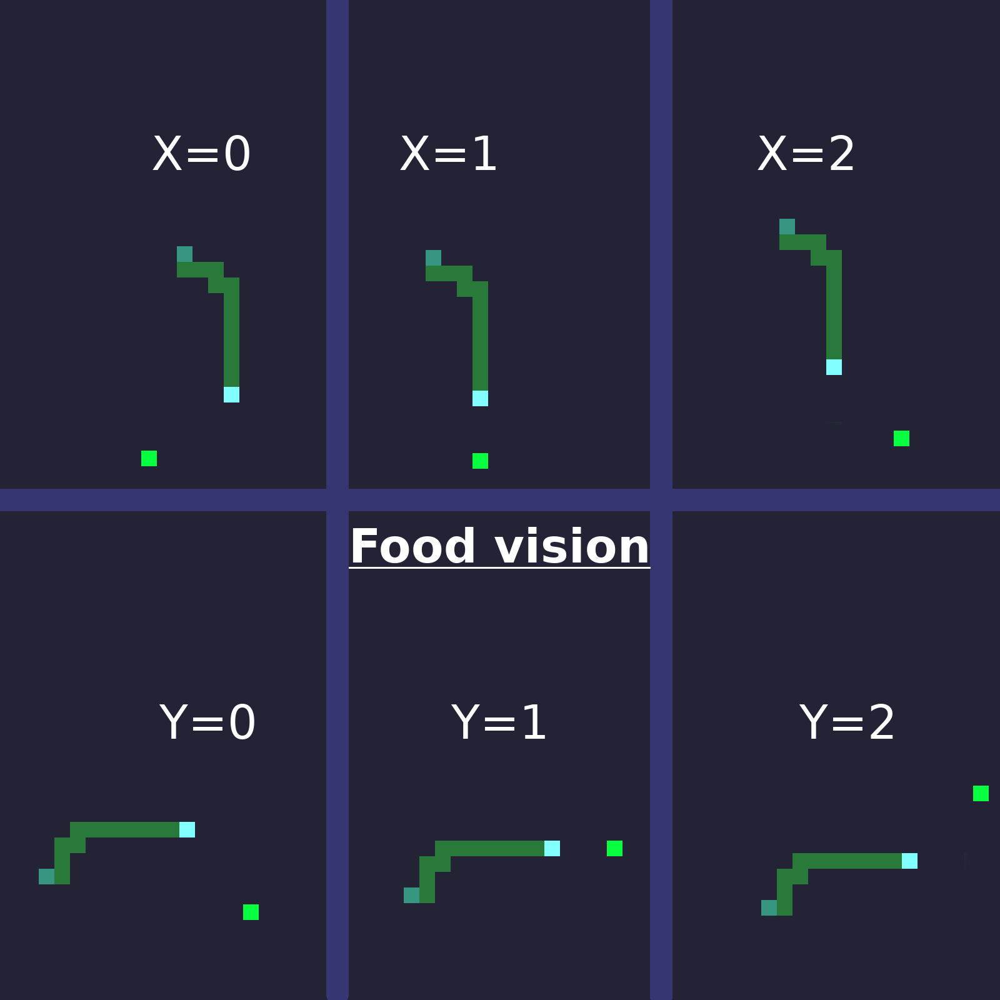
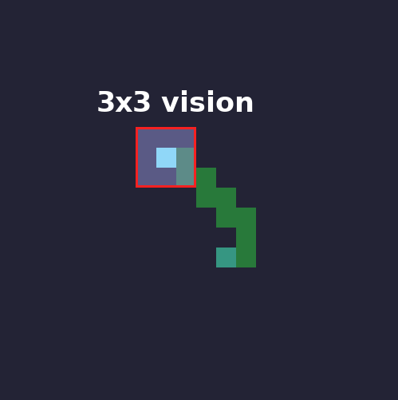
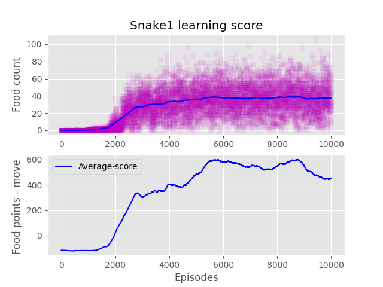
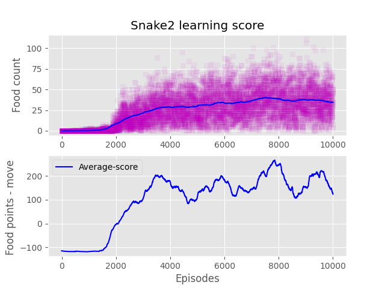
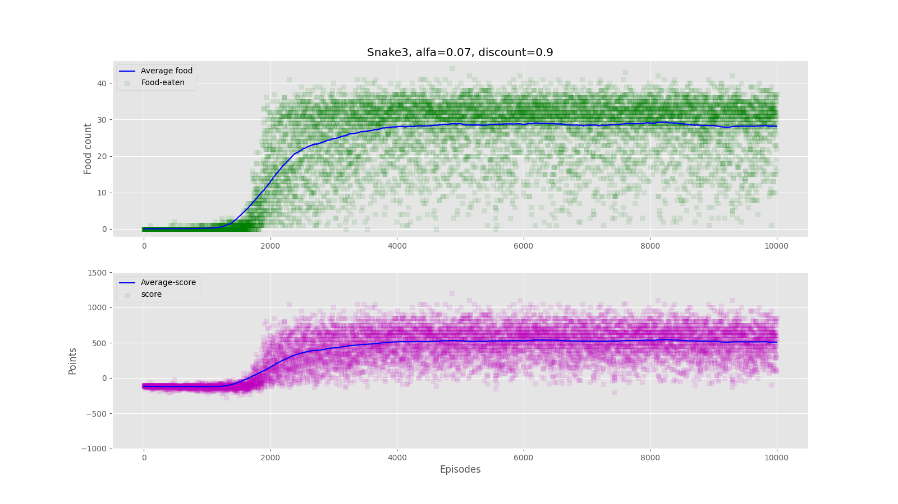
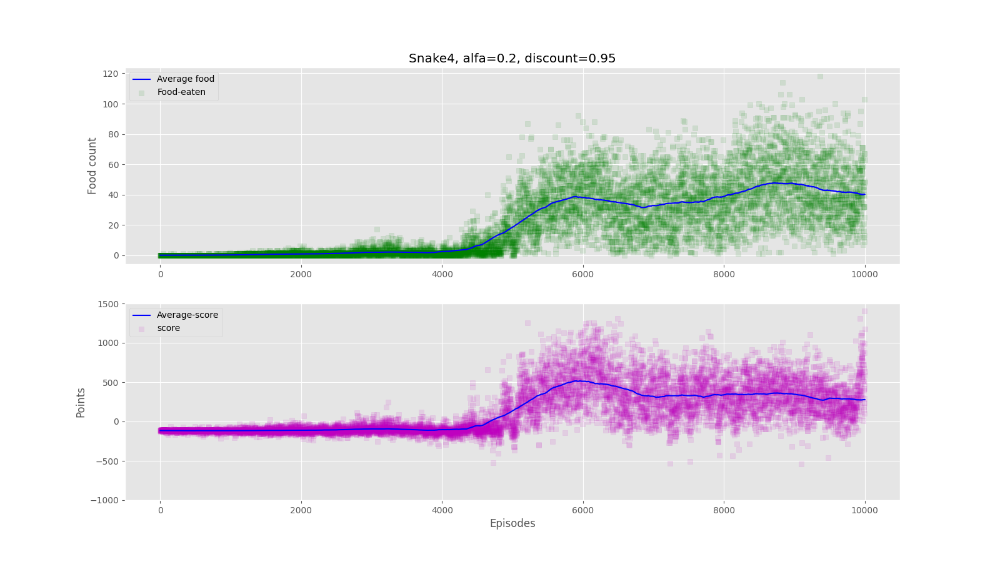

# About Snake Q-learning
Learning repository.
Target is to implement q-learning in different environment than gym-ai.

#### Python Version

Python==3.7.6

## Todo:
- [x] Write Game environment
- [ ] Teach AI to play
	- [x] Implement reinforced learning
	- [x] Train 
	- [x] Get highest score possible
	- [x] Try different inputs:
	    * current direction + relative food position + field around head(3,3)
 
- [ ] Use deep q-learning
    - [ ] input whole area ahead
  
## Snake inputs (vision)

Snake has knowledge of relative position to head. It is combination of `x` and `y`

Collision detection

  
## Q-learning results

#### Score

Score is calculated as follows:
* 50 pts per food consumed
* -1 per move
* -100 every run as death reward

Snake 4 has higher epsilon earlier and 0 at 5000 episode.

## Videos:

Snake 1 - default ml parameters

#
Snake 2 - faster learning parameters

#
