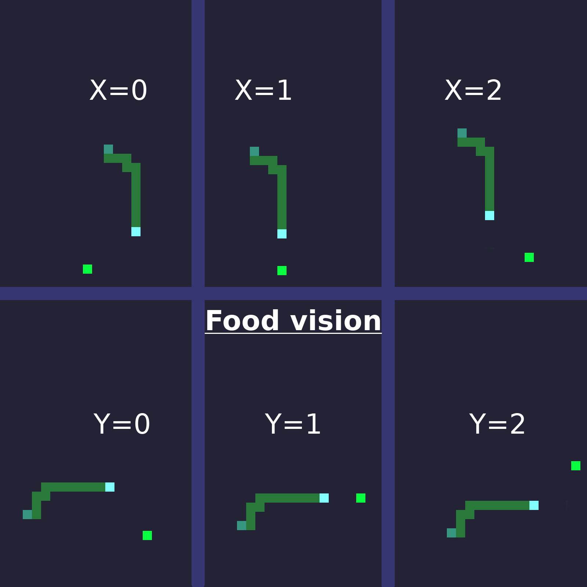
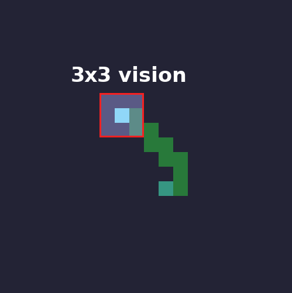
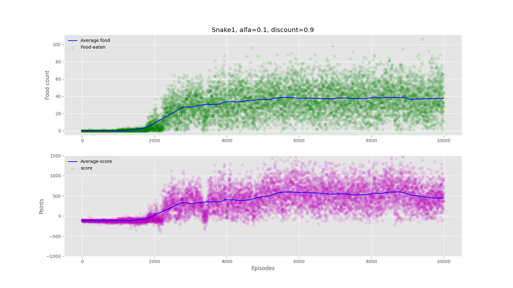
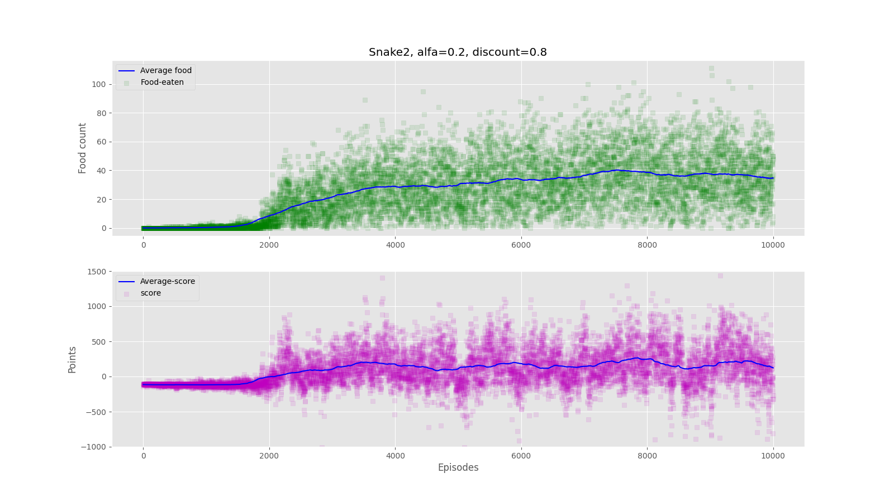
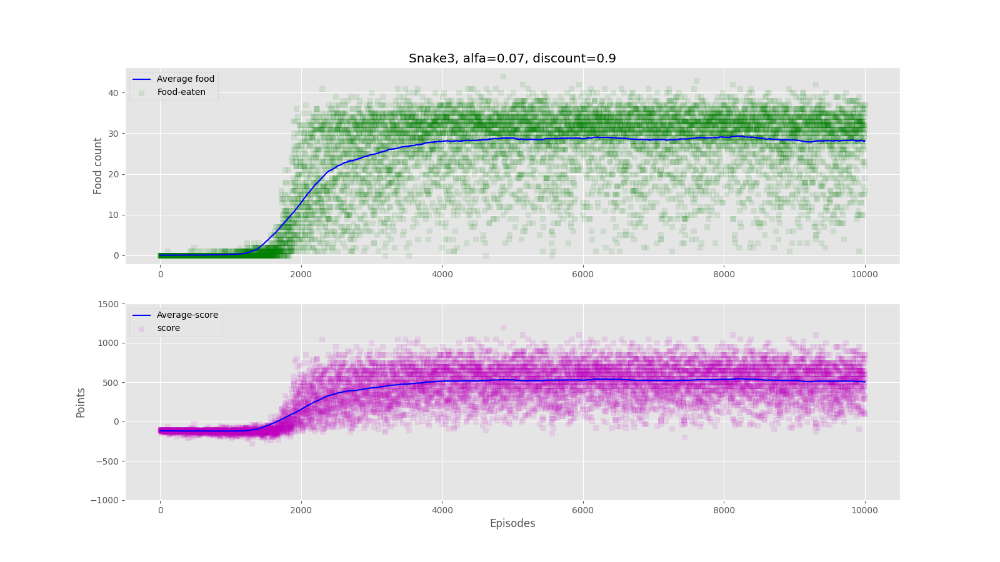
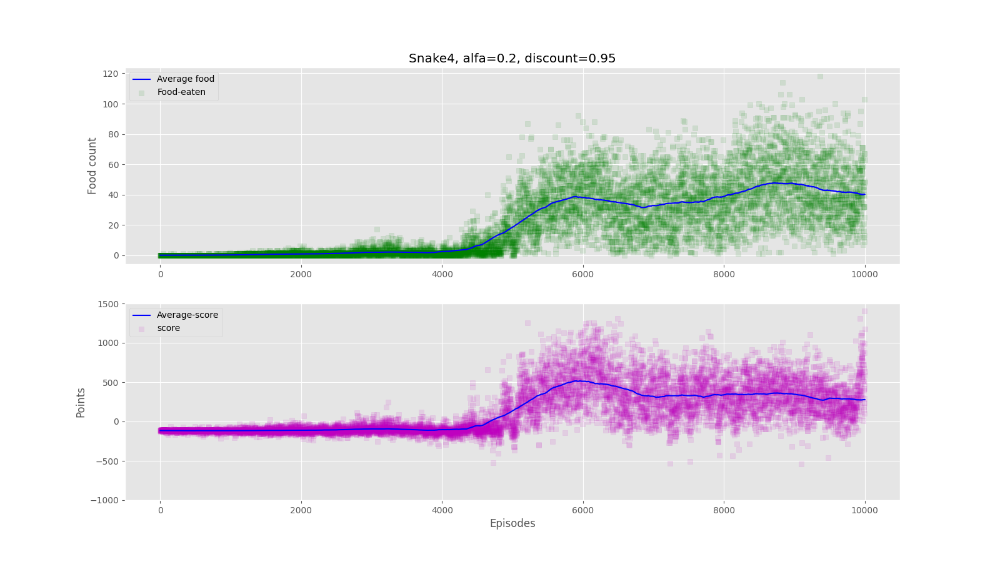
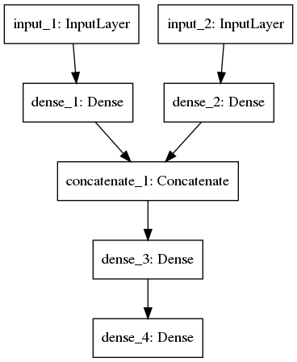
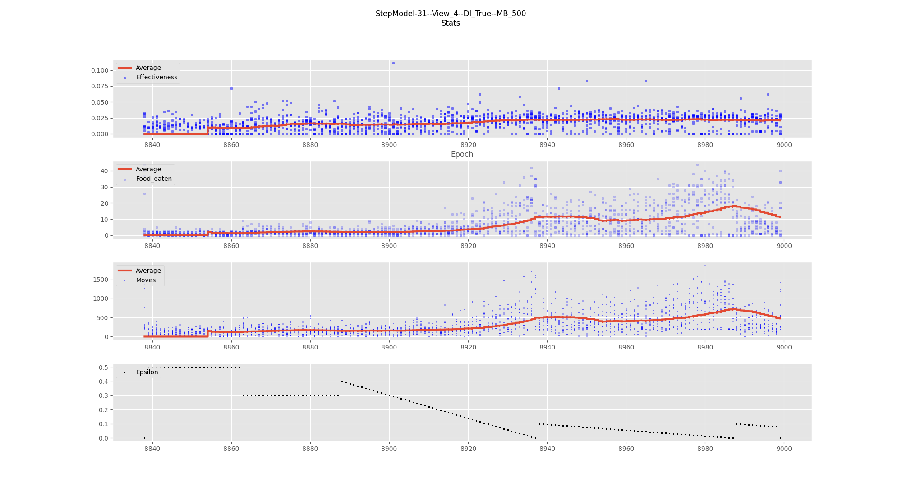

# About repository
Learning repository.
Target is to implement q-learning in different environment than gym-ai.

Target has been achieved both in q-learning and deep q-learning.

I learned here how to use models with more inputs than one, define custom models and connections
I used 2 techniques of training:
* `epoch`, training every epoch
* `step`, training model every step he made

Step method, is more efficient, model learns quicker and we can teach him all samples he gained from last move.

Convolutional layers would greatly improve deep learning.

# Table of Contents
1. [Environment](#env)
    * python version
    * objectives
1. [Snake inputs](#input)
    * Smell (food position)
    * Vision
2. [Q-learning results](#qlearning)
    * Results
    * Videos
3. [Deep Q-learning results](#deepqlearning)
    * Model
    * Results
  
  
## Environment <a name="env"/>
  
#### Python Version

`Python==3.7.6`

### Todo:
- [x] Write Game environment
- [x] Teach AI to play
	- [x] Implement reinforced learning
	- [x] Train 
	- [x] Get highest score possible
	- [x] Try different inputs:
        - [x] current direction + relative food position + field around head(3,3)
        - [x] relative food position + field around head(3,3) and 4 actions
 
- [x] Use deep q-learning
    - [x] input whole area ahead
    

  
## Snake inputs <a name="input"/>
#### Smell

* Snake has knowledge of relative position to head. It is combination of `x` and `y`

* In deep learning, position is float number in range `<-1, 1>`, downscaled by arena width and height.

#### View area
In deep learning area is bigger, and also can see food.

  
## Q-learning results <a name="qlearning"/>

#### Score

Score is calculated as follows:
* 50 pts per food consumed
* -1 per move
* -100 every run as death reward

Snake 4 has higher epsilon earlier and 0 at 5000 episode.

#### Videos:

Snake 1 - default ml parameters

#
Snake 2 - faster learning parameters

## Deep Q-learning  results <a name="deepqlearning"/>

    

#### Model with 2 inputs
First input is view area, obstacles and food that snake can see.

Second input is food postion relative to head, in range `<-1, 1>` 

Results from training up to 9000 episodes. Each episode has 10 agents playing.

Effectiveness is calculated as `food-eaten / moves-done`. We can see rising values, both food and effectiveness.

#### Video / gif
< Will be posted here >

